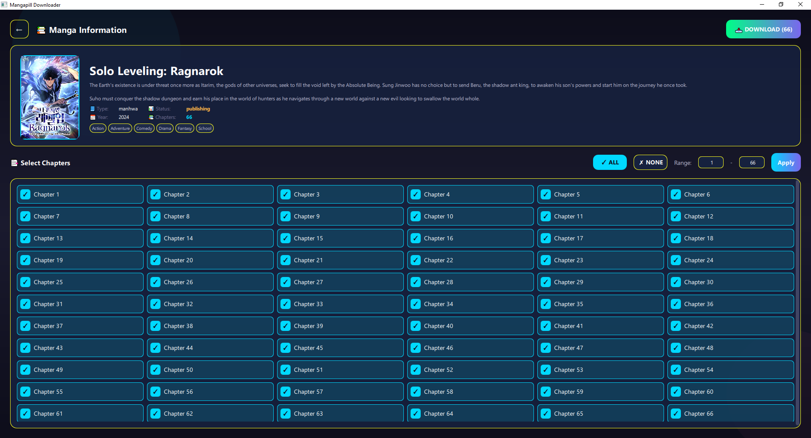

<p align="center">
  
</p>

<p align="center">
  <a href="https://github.com/Yui007/mangapill-downloader/stargazers"></a>
  <a href="https://github.com/Yui007/mangapill-downloader/network/members"></a>
  <a href="https://github.com/Yui007/mangapill-downloader/issues"></a>
  <a href="https://github.com/Yui007/mangapill-downloader/blob/main/LICENSE"></a>
</p>

<p align="center">
  
  
</p>

---

## ✨ Features

<table>
<tr>
<td>

🎨 **Two Beautiful Interfaces**
- ✨ Modern PyQt6 + QML GUI
- 💻 Rich interactive CLI
- Stunning dark glassmorphism theme

</td>
<td>

⚡ **Lightning Fast Downloads**
- Concurrent chapter downloads
- Parallel image fetching
- Configurable worker threads

</td>
</tr>
<tr>
<td>

📚 **Flexible Chapter Selection**
- Single chapter: `5`
- Range: `1-10`
- Multiple: `1,3,5-7`
- All chapters: `all`

</td>
<td>

📦 **Multiple Output Formats**
- 🖼️ Raw Images
- 📕 PDF (with img2pdf)
- 📦 CBZ (with ComicInfo.xml)

</td>
</tr>
<tr>
<td>

🔄 **Smart Retry Logic**
- Auto-retry on failures
- Exponential backoff
- Configurable attempts

</td>
<td>

⚙️ **Persistent Settings**
- JSON config file
- Customizable defaults
- Easy to modify

</td>
</tr>
</table>

---

## 📸 Preview

### CLI Interface

```
╔══════════════════════════════════════════════════════════════════════════════╗
║   ███╗   ███╗ █████╗ ███╗   ██╗ ██████╗  █████╗ ██████╗ ██╗ ██      ██       ║
║   ████╗ ████║██╔══██╗████╗  ██║██╔════╝ ██╔══██╗██╔══██╗██║ ██      ██       ║
║   ██╔████╔██║███████║██╔██╗ ██║██║  ███╗███████║██████╔╝██║ ██      ██       ║
║   ██║╚██╔╝██║██╔══██║██║╚██╗██║██║   ██║██╔══██║██╔═══╝ ██║ ██      ██       ║
║   ██║ ╚═╝ ██║██║  ██║██║ ╚████║╚██████╔╝██║  ██║██║     ██║ ██████  ██████   ║
║   ╚═╝     ╚═╝╚═╝  ╚═╝╚═╝  ╚═══╝ ╚═════╝ ╚═╝  ╚═╝╚═╝     ╚═╝                  ║
║            ██████╗  ██████╗ ██╗    ██╗███╗   ██╗                             ║
║            ██╔══██╗██╔═══██╗██║    ██║████╗  ██║                             ║
║            ██║  ██║██║   ██║██║ █╗ ██║██╔██╗ ██║                             ║
║            ██║  ██║██║   ██║██║███╗██║██║╚██╗██║                             ║
║            ██████╔╝╚██████╔╝╚███╔███╔╝██║ ╚████║                             ║
║            ╚═════╝  ╚═════╝  ╚══╝╚══╝ ╚═╝  ╚═══╝                             ║
║                    Version 1.0.0                                             ║
╚══════════════════════════════════════════════════════════════════════════════╝
```

### GUI Interface

<p align="center">
  
</p>

*Modern dark theme GUI with glassmorphism design, chapter selection, and real-time download progress.*

---

## 🚀 Quick Start

### Installation

```bash
# Clone the repository
git clone https://github.com/Yui007/mangapill-downloader.git
cd mangapill-downloader

# Install dependencies
pip install -r requirements.txt
```

### CLI Usage

```bash
# Interactive CLI mode
python main.py

# Direct download with URL
python main.py download https://mangapill.com/manga/ID/manga-name

# Download specific chapters as PDF
python main.py download URL -c 1-10 -f pdf

# View manga info only
python main.py info URL

# Manage settings
python main.py settings
```

### GUI Usage

```bash
# Launch the beautiful GUI
python gui/main_gui.py
```

The GUI features:
- 🎴 Dark glassmorphism theme with neon accents
- 🔗 URL input with manga info display
- ☑️ Visual chapter selection (All/Range/Custom)
- 📊 Real-time download progress
- ⚙️ Settings panel with sliders and toggles

---

## 🎮 Interactive Mode

Just run `python main.py` and you'll see the main menu:

```
╭─────────────────────────────────╮
│        📋 Main Menu             │
╰─────────────────────────────────╯

  [1] 📥 Download Manga
  [2] ⚙️  Settings
  [3] 🚪 Exit
```

---

## 📖 Chapter Selection

When downloading, you can select chapters in multiple ways:

| Input | Result |
|-------|--------|
| `all` | Download all chapters |
| `5` | Download chapter 5 only |
| `1-10` | Download chapters 1 through 10 |
| `1,3,5-7` | Download chapters 1, 3, 5, 6, and 7 |

---

## 📦 Output Formats

| Format | Description |
|--------|-------------|
| **Images** | Raw image files in numbered folders |
| **PDF** | Single PDF per chapter (lossless conversion) |
| **CBZ** | Comic book archive with `ComicInfo.xml` metadata |

---

## ⚙️ Configuration

Settings are stored in `config.json`:

```json
{
  "output_dir": "./downloads",
  "output_format": "images",
  "keep_images": true,
  "max_chapter_workers": 3,
  "max_image_workers": 5,
  "retry_count": 3,
  "retry_base_delay": 2.0
}
```

| Setting | Description | Default |
|---------|-------------|---------|
| `output_dir` | Download location | `./downloads` |
| `output_format` | Default format (images/pdf/cbz) | `images` |
| `keep_images` | Keep images after PDF/CBZ conversion | `true` |
| `max_chapter_workers` | Concurrent chapter downloads | `3` |
| `max_image_workers` | Concurrent image downloads per chapter | `5` |
| `retry_count` | Number of retry attempts | `3` |
| `retry_base_delay` | Base delay between retries (seconds) | `2.0` |

---

## 📁 Project Structure

```
mangapill-downloader/
├── main.py                 # CLI entry point
├── config.json             # User settings (generated)
├── requirements.txt        # Dependencies
├── src/                    # Core backend
│   ├── config.py           # Config management
│   ├── constants.py        # Headers & branding
│   ├── scrapers/
│   │   ├── manga.py        # Manga info scraper
│   │   └── chapter.py      # Chapter images scraper
│   ├── downloader/
│   │   ├── manager.py      # Thread pool manager
│   │   └── retry.py        # Retry decorator
│   ├── converters/
│   │   ├── pdf.py          # PDF converter
│   │   ├── cbz.py          # CBZ converter
│   │   └── comicinfo.py    # ComicInfo.xml generator
│   └── cli/
│       ├── app.py          # Typer commands
│       ├── prompts.py      # Interactive prompts
│       └── display.py      # Rich UI components
└── gui/                    # PyQt6 + QML GUI
    ├── main_gui.py         # GUI entry point
    ├── bridge.py           # Python ↔ QML bridge
    └── qml/
        ├── main.qml        # Main window
        ├── theme/          # Colors & styling
        ├── components/     # Reusable UI components
        └── screens/        # App screens
```

---

## 🔧 Requirements

- Python 3.10+
- **CLI Dependencies:**
  - `typer[all]` - CLI framework
  - `rich` - Beautiful terminal UI
  - `requests` - HTTP client
  - `beautifulsoup4` - HTML parsing
  - `Pillow` - Image processing
  - `img2pdf` - PDF generation
  - `lxml` - XML processing
- **GUI Dependencies:**
  - `PyQt6` - Qt6 Python bindings

---

## 🤝 Contributing

Contributions are welcome! Feel free to:

1. Fork the repository
2. Create a feature branch (`git checkout -b feature/amazing-feature`)
3. Commit your changes (`git commit -m 'Add amazing feature'`)
4. Push to the branch (`git push origin feature/amazing-feature`)
5. Open a Pull Request

---

## 📝 License

This project is licensed under the MIT License - see the [LICENSE](LICENSE) file for details.

---

## ⚠️ Disclaimer

This tool is for personal use only. Please respect the terms of service of mangapill.com and support the official releases of manga you enjoy.

---

<p align="center">
  Made with ❤️ by <a href="https://github.com/Yui007">Yui007</a>
</p>

<p align="center">
  <a href="#-features">Features</a> •
  <a href="#-quick-start">Quick Start</a> •
  <a href="#-configuration">Configuration</a> •
  <a href="#-contributing">Contributing</a>
</p>
